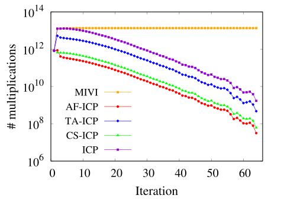

# Compare AF-ICP with ICP, TA-ICP, and CS-ICP
This includes the [src](./src), aficp.c, icp.c, taicp, and csicp.c, 
in addition of each Makefile_*,
and the execution perl scripts [exe](./exe) for the 8.2M-sized PubMed data set.

|#multiplications|Elapsed time|
|---|---|
|||
